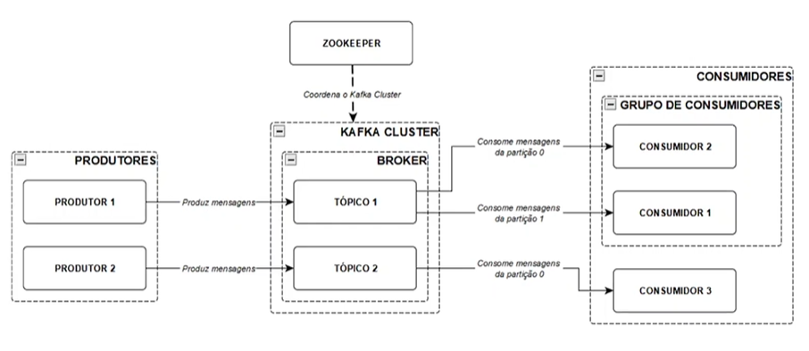
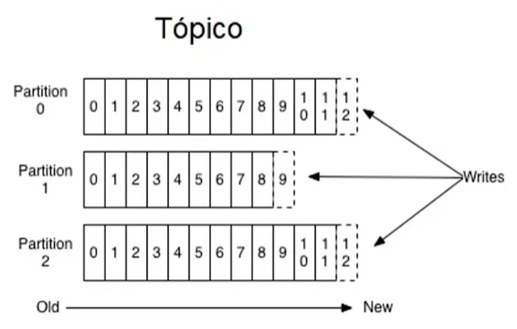

# **Apache Kafka**
Este documento é um guia sobre os principais conceitos e configurações.

# ⚙️ Arquitetura do Kafka


# 🎛️ Componentes
## 🔹 **Broker**
**Definição:** Servidores que armazenam e gerenciam as partições dos tópicos no Kafka.<br/>
**Funcionamento:** Constituem o cluster Kafka e são responsáveis por receber, armazenar e replicar os dados.<br/>
**Características:** Escalabilidade horizontal e replicação de dados.<br/>
**Uso Prático:** Executam em servidores dedicados ou em contêineres, dependendo dos requisitos de escala e desempenho.<br/>
**Benefícios:** Oferecem armazenamento confiável e distribuído para os dados e permitem dimensionar horizontalmente para lidar com volumes crescentes de dados.<br/>

| Configuração | Descrição |
| ------- | --------- |
| broker.id | Identificador único para cada broker no cluster Kafka. |
| listeners | Endereço e porta para o qual o broker está configurado para escutar conexões de clientes e outros brokers. |
| log.dirs | Diretório onde os logs de segmentos de dados do Kafka serão armazenados. |
| num.partitions | Número padrão de partições que serão criadas para cada tópico automaticamente, a menos que seja especificado de outra forma durante a criação. |
| auto.create.topics.enable | Indica se o Kafka deve criar automaticamente tópicos quando os produtores os publicam pela primeira vez. |
| default.replication.factor | Número padrão de réplicas para serem mantidas para cada tópico. |
| min.insync.replicas | Número mínimo de réplicas que devem estar em sincronia para que uma gravação seja considerada bem-sucedida. |
| log.retention.hours | Número de horas para quanto tempo os segmentos de log de uma partição serão mantidos antes de serem descartados. |
| log.segment.bytes | Tamanho máximo em bytes de cada segmento de log antes que um novo segmento seja criado. |
| num.recovery.threads.per.data.dir | Número de threads de recuperação por diretório de log. |

## 🔹 **Tópico**
**Definição:** Canais de comunicação categorizados para dados no Kafka.<br/>
**Funcionamento:** Produtores enviam mensagens para tópicos, essas mensagens são consumidas por consumidores. Tópicos podem ter múltiplas partições para distribuição e paralelismo, e cada partição possui vários offsets. Cada partição só pode ser consumida por um consumidor.<br/>
**Características:** Flexibilidade na criação e configuração e suporta retenção de mensagens por tempo ou tamanho.<br/>
**Uso Prático:** Mensagens direcionadas a tópicos específicos para organização eficiente.<br/>
**Benefícios:** Facilita a organização e gerenciamento de dados, permite processamento paralelo e distribuído.



| Configuração | Descrição |
| ------- | --------- |
| num.partitions | Número de partições que serão criadas para o tópico. |
| replication.factor | Número de réplicas a serem mantidas para cada partição do tópico. |
| retention.ms | Tempo de retenção padrão em milissegundos para mensagens em uma partição antes que sejam descartadas. |
| cleanup.policy | Política de limpeza de log para o tópico. Pode ser "delete" para excluir mensagens antigas ou "compact" para compactar mensagens. |
| min.insync.replicas | Número mínimo de réplicas que devem estar em sincronia para que uma gravação seja considerada bem-sucedida. |
| segment.bytes | Tamanho máximo em bytes de cada segmento de log antes que um novo segmento seja criado. |
| retention.bytes | Tamanho máximo em bytes de mensagens que podem ser retidas em uma partição antes que sejam lidas. |
| max.message.bytes | Tamanho máximo em bytes permitido para uma única mensagem. |
| message.timestamp.type | Tipo de timestamp a ser usado para mensagens. Pode ser "CreateTime" ou "LogAppendTime". |
| message.timestamp.difference.ms | O intervalo máximo de tempo em milissegundos pelos quais o timestamp da mensagem pode ser mais recente do que o tempo de registro do broker. |

<details>
    <summary><strong style="font-size:1.2em;">🎮 <b>Principais comandos do tópico</b></strong></summary><br/>

Cria um novo tópico especificando algumas configurações:    
```bash
kafka-topics.sh --create --bootstrap-server <host_bootstrap>:<porta_bootstrap> --replication-factor <fator_replicaçao> --partitions <num_partições> --topic <nome_tópico>
```
Lista todos os tópicos disponíveis no cluster:
```bash
kafka-topics.sh --list --bootstrap-server <host_bootstrap>:<porta_bootstrap>
```
Fornece informações detalhadas sobre um tópico específico, incluindo partições e réplicas:
```bash
kafka-topics.sh --describe --bootstrap-server <host_bootstrap>:<porta_bootstrap> --topic <nome_tópico>
```
Exclui o tópico especificado:
```bash
kafka-topics.sh --delete --bootstrap-server <host_bootstrap>:<porta_bootstrap> --topic <nome_tópico>
```
Altera a configuração de um tópico, como políticas de retenção ou políticas de limpeza:
```bash
kafka-configs.sh --alter --bootstrap-server <host_bootstrap>:<porta_bootstrap> --entity-type topics --entity-name <nome_tópico> --add-config retention.ms=<tempo_retenção_em_ms>
```
Aumenta ou diminui o número de partições para um tópico:
```bash
kafka-topics.sh --alter --bootstrap-server <host_bootstrap>:<porta_bootstrap> --topic <nome_tópico> --partitions <novo_número_partições>
```
</details>

## 🔹 **Produtor**
**Definição:** Responsável por enviar dados para o Kafka.<br/>
**Funcionamento:** Envia mensagens para tópicos Kafka de forma assíncrona ou síncrona.<br/>
**Características:** Alta taxa de transferência, tolerância a falhas, configurações flexíveis.<br/>
**Uso P**rático: Aplicativos web, IoT, sistemas distribuídos.<br/>
**Benefícios:** Facilita a ingestão de dados em tempo real, escalabilidade, integração fácil.<br/>

| Configuração | Descrição |
| ------- | --------- |
| bootstrap.servers | Lista de servidores Kafka utilizados para inicializar a conexão do produtor com o cluster. |
| acks | Define o número de réplicas em que a mensagem deve ser confirmada como gravada antes de o produtor receber uma resposta. |
| retries | Número máximo de tentativas de reenvio em caso de falha no envio da mensagem. |
| batch.size | Tamanho máximo em bytes de cada lote de mensagens a serem enviadas ao broker. |
| linger.ms | Tempo máximo em milissegundos que o produtor aguardará para enviar um lote completo de mensagens. |
| buffer.memory | Tamanho total de memória em bytes a ser utilizado para armazenar as mensagens antes do envio ao broker. |
| key.serializer | Classe responsável por serializar a chave da mensagem. |
| value.serializer | Classe responsável por serializar o valor da mensagem. |

<details>
    <summary><strong style="font-size:1.2em;">🎮 <b>Principais comandos do produtor</b></strong></summary><br/>

Inicia um produtor de console que envia mensagens para o tópico Kafka especificado:
```bash
kafka-console-producer.sh --broker-list <lista_brokers> --topic <nome_tópico>
```
Inicia um produtor de console que envia mensagens com chaves para o tópico Kafka especificado:
```bash
kafka-console-producer.sh --broker-list <lista_brokers> --topic <nome_tópico> --property parse.key=true --property key.separator=<separador_chave>
```
Testa o desempenho do produtor enviando um número específico de registros para o tópico Kafka especificado:
```bash
kafka-producer-perf-test.sh --producer.config <arquivo_config_producer> --topic <nome_tópico> --num-records <num_registros> --record-size <tamanho_registro>
```
Inicia um produtor de console verificável que envia mensagens para o tópico Kafka especificado:
```bash
kafka-verifiable-producer.sh --broker-list <lista_brokers> --topic <nome_tópico> --max-messages <max_mensagens>
```
Inicia um produtor de console que envia mensagens Avro para o tópico Kafka especificado:
```bash
kafka-avro-console-producer --broker-list <lista_brokers> --topic <nome_tópico> --property value.schema='<schema_avro>'
```
</details>

<br/><br/>
[](https://www.linkedin.com/in/leitefabricio)